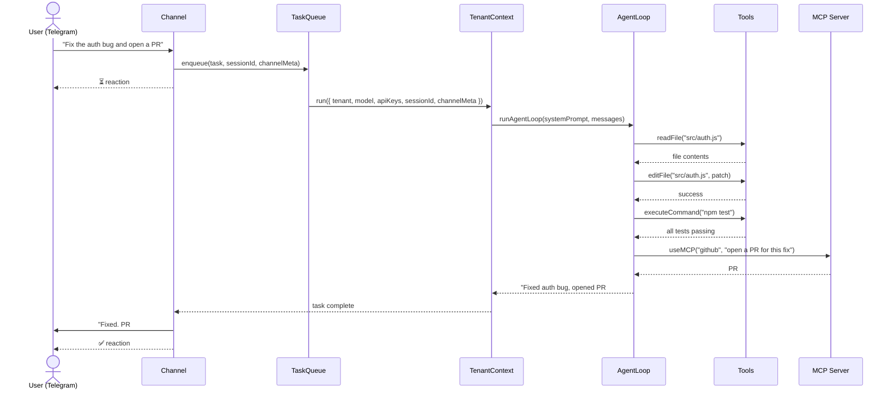
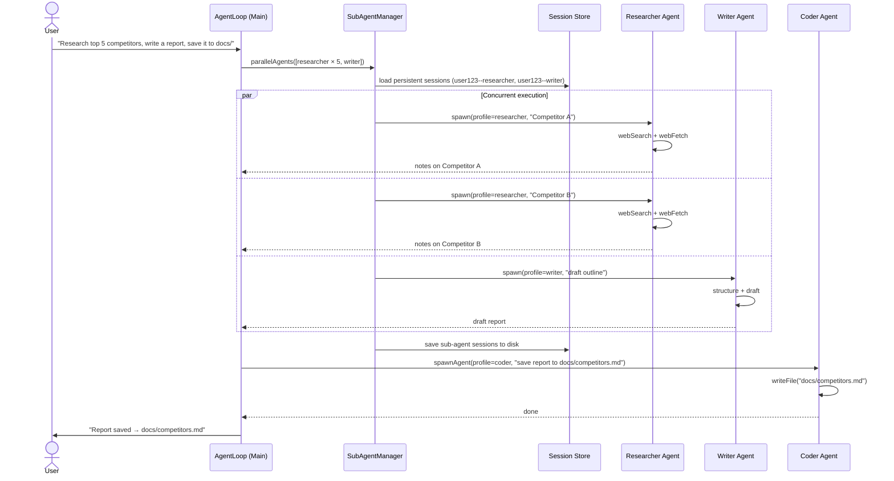
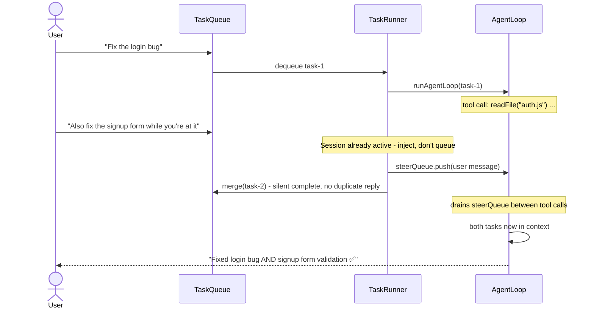

# Daemora

**A fully autonomous, self-hosted AI agent - production-secure, multi-tenant, multi-channel.**

[](https://npmjs.com/package/daemora)
[](LICENSE)
[](https://nodejs.org)
[](#)

Daemora runs on your own machine. It connects to your messaging apps, accepts tasks in plain language, executes them autonomously with 51 built-in tools across 20 channels, and reports back - without you watching over it.

Unlike cloud AI assistants, nothing leaves your infrastructure except the tokens you intentionally send to model APIs. You own the data, the keys, and the security boundary.

---

## What Daemora Can Do

| Capability | Description |
|---|---|
| **Code** | Write, edit, run, test, and debug code across multiple files. Takes screenshots of UIs to verify output. Fixes failing tests. Ships working software. |
| **Research** | Search the web, read pages, analyse images, cross-reference sources, write reports. Spawns parallel sub-agents for speed. |
| **Automation** | Schedule recurring tasks via cron. Monitor repos, inboxes, or APIs. React to events. Runs while you sleep. |
| **Communicate** | Send emails, Telegram messages, Slack posts, Discord messages - autonomously. Screenshots, files, and media sent directly back to you via `replyWithFile`. |
| **Tools** | Connect to any MCP server - create Notion pages, open GitHub issues, update Linear tasks, manage Shopify products, query databases. |
| **Multi-Agent** | Spawn parallel sub-agents (researcher + coder + writer working simultaneously). Each inherits the parent's model and API keys. Persistent sessions - specialists remember context across tasks. |
| **Multi-Tenant** | Run one instance for your whole team. Per-user memory, cost caps, tool allowlists, filesystem isolation, and encrypted API keys. |

---

## Architecture

```
┌─────────────────────────────────────────────────────────────────┐
│                      INPUT CHANNELS (20)                        │
│  Telegram · WhatsApp · Discord · Slack · Email · LINE ·         │
│  Signal · Teams · Google Chat · Matrix · Mattermost · Twitch ·  │
│  IRC · iMessage · Feishu · Zalo · Nextcloud · BlueBubbles ·     │
│  Nostr · HTTP                                                   │
└───────────────────────────┬─────────────────────────────────────┘
                            │
                            ▼
┌─────────────────────────────────────────────────────────────────┐
│                    MULTI-TENANT LAYER                           │
│  TenantManager + TenantContext (AsyncLocalStorage)              │
│  Per-user: model, tools, MCP servers, filesystem, cost caps,    │
│  encrypted API keys, isolated memory, channel context           │
└───────────────────────────┬─────────────────────────────────────┘
                            │
                            ▼
┌─────────────────────────────────────────────────────────────────┐
│                       TASK QUEUE                                │
│  Priority queue · Per-session serialisation                     │
│  Steer/inject: follow-up messages injected into running loop    │
│  Cost budget check · Tenant suspension check                    │
│  Persistent sessions · Auto-cleanup (configurable retention)    │
└───────────────────────────┬─────────────────────────────────────┘
                            │
                            ▼
┌─────────────────────────────────────────────────────────────────┐
│                      AGENT LOOP                                 │
│  Vercel AI SDK (generateText + tool_use)                        │
│  System prompt: SOUL.md + memory + daily log + task context     │
│  Model: OpenAI · Anthropic · Google · Ollama (local)            │
│  Context compaction when approaching model limits               │
└──────────────┬─────────────────────────────────┬────────────────┘
               │                                 │
               ▼                                 ▼
┌──────────────────────────┐      ┌──────────────────────────────┐
│   BUILT-IN TOOLS (51)    │      │        SUB-AGENTS            │
│  File I/O · Shell        │      │  spawnAgent · parallelAgents │
│  Web · Browser           │      │  delegateToAgent             │
│  Email · Messaging       │      │  Profiles: coder / researcher│
│  Vision · TTS · PDF      │      │  / writer / analyst          │
│  Memory · Documents      │      │  Persistent sessions (--sep) │
│  Cron · Agents · MCP     │      │  Inherit model + API keys    │
│  Git · SSH · Database    │      │  Max depth: 3  Max: 7 agents │
│  Calendar · IoT          │      │  Task-type model routing     │
└──────────────────────────┘      └──────────────┬───────────────┘
                                                 │
                                                 ▼
                                  ┌──────────────────────────────┐
                                  │       MCP SERVERS            │
                                  │  Per-server specialist agent │
                                  │  GitHub · Notion · Linear    │
                                  │  Slack · Postgres · Puppeteer│
                                  │  stdio / HTTP / SSE          │
                                  └──────────────────────────────┘
```

### Security Architecture (12 Layers)

```
  LAYER 1   Permission Tiers ────── minimal / standard / full
  LAYER 2   Filesystem Sandbox ──── ALLOWED_PATHS · BLOCKED_PATHS · hardcoded blocks · per-tenant workspace isolation
  LAYER 3   Secret Vault ─────────── AES-256-GCM · scrypt key derivation · passphrase on start
  LAYER 4   Channel Allowlists ──── per-channel user ID whitelist
  LAYER 5   A2A Security ─────────── bearer token · agent allowlist · rate limiting
  LAYER 6   Audit Trail ──────────── append-only JSONL · secrets redacted · tenantId tagged
  LAYER 7   Supervisor Agent ─────── runaway loop detection · cost overruns · dangerous patterns
  LAYER 8   Input Sanitisation ──── untrusted-input wrapping · prompt injection detection
  LAYER 9   Multi-Tenant Isolation ─ AsyncLocalStorage · no cross-tenant data leakage
  LAYER 10  Security Audit CLI ──── daemora doctor · 8 checks · scored output
  LAYER 11  Command Guard ─────────── blocks env dumps · .env reads · credential exfil · CLI privilege escalation
  LAYER 12  Tool Filesystem Guard ── all 18 file-touching tools enforce checkRead/checkWrite
```

---

## Sequence Diagrams

### Task Lifecycle - from message to response



---

### Multi-Agent - parallel sub-agents



---

### Steer/Inject - follow-up message mid-task



---

## Quick Start

```bash
npm install -g daemora
daemora setup      # interactive wizard (11 steps) - models, channels, tools, cleanup, vault, MCP, multi-tenant
daemora start      # start the agent
```

Then message your bot. That's it.

---

## Installation

### npm (recommended)

```bash
npm install -g daemora
daemora setup
daemora start
```

### Clone from source

```bash
git clone https://github.com/CodeAndCanvasLabs/Daemora.git
cd daemora-agent
pnpm install
cp .env.example .env
# Add your API keys to .env
daemora setup
daemora start
```

### Run as a system daemon (always on)

```bash
daemora daemon install    # Register as a system service (launchctl / systemd / Task Scheduler)
daemora daemon start      # Start in background
daemora daemon status     # Check status
daemora daemon logs       # View logs
daemora daemon stop       # Stop
```

---

## Configuration

Copy `.env.example` to `.env` and fill in what you need.

### AI Models

At least one provider is required:

```env
OPENAI_API_KEY=sk-...
ANTHROPIC_API_KEY=sk-ant-...
GOOGLE_AI_API_KEY=...
XAI_API_KEY=...
DEEPSEEK_API_KEY=...
MISTRAL_API_KEY=...

# Default model (used when no model is specified)
DEFAULT_MODEL=openai:gpt-4.1-mini
```

**7 providers, 10+ models:**

| Model ID | Description |
|---|---|
| `openai:gpt-4.1` | Most capable OpenAI model |
| `openai:gpt-4.1-mini` | Fast and cheap - good default |
| `openai:o3-mini` | Reasoning-optimised |
| `anthropic:claude-opus-4-6` | Best for complex reasoning |
| `anthropic:claude-sonnet-4-6` | Balanced - great for code |
| `anthropic:claude-haiku-4-5` | Fastest Anthropic model |
| `google:gemini-2.0-flash` | Fastest Google model |
| `xai:grok-4` | xAI flagship |
| `deepseek:deepseek-chat` | DeepSeek V3 |
| `mistral:mistral-large-2512` | Mistral flagship |
| `ollama:llama3` | Local - no API key needed |

### Task-Type Model Routing (optional)

Route different task types to the best model automatically:

```env
CODE_MODEL=anthropic:claude-sonnet-4-6
RESEARCH_MODEL=google:gemini-2.0-flash
WRITER_MODEL=openai:gpt-4.1
ANALYST_MODEL=openai:gpt-4.1
```

When a sub-agent is spawned with `profile: "coder"`, it automatically uses `CODE_MODEL`. Sub-agents without an explicit model inherit from their parent.

### Channels (20)

Enable only what you need. Each channel supports `{CHANNEL}_ALLOWLIST` and `{CHANNEL}_MODEL` overrides.

| Channel | Required Env Vars |
|---|---|
| **Telegram** | `TELEGRAM_BOT_TOKEN` |
| **WhatsApp** | `TWILIO_ACCOUNT_SID`, `TWILIO_AUTH_TOKEN`, `TWILIO_WHATSAPP_FROM` |
| **Discord** | `DISCORD_BOT_TOKEN` |
| **Slack** | `SLACK_BOT_TOKEN`, `SLACK_APP_TOKEN` |
| **Email (Resend)** | `RESEND_API_KEY`, `RESEND_FROM` |
| **Email (IMAP/SMTP)** | `EMAIL_USER`, `EMAIL_PASSWORD`, `EMAIL_IMAP_HOST`, `EMAIL_SMTP_HOST` |
| **LINE** | `LINE_CHANNEL_ACCESS_TOKEN`, `LINE_CHANNEL_SECRET` |
| **Signal** | `SIGNAL_CLI_PATH`, `SIGNAL_PHONE_NUMBER` |
| **Microsoft Teams** | `TEAMS_APP_ID`, `TEAMS_APP_PASSWORD` |
| **Google Chat** | `GOOGLE_CHAT_CREDENTIALS_PATH`, `GOOGLE_CHAT_SPACE_ID` |
| **Matrix** | `MATRIX_HOMESERVER_URL`, `MATRIX_ACCESS_TOKEN`, `MATRIX_USER_ID` |
| **Mattermost** | `MATTERMOST_URL`, `MATTERMOST_BOT_TOKEN` |
| **Twitch** | `TWITCH_BOT_USERNAME`, `TWITCH_OAUTH_TOKEN`, `TWITCH_CHANNEL` |
| **IRC** | `IRC_SERVER`, `IRC_NICKNAME`, `IRC_CHANNEL` |
| **iMessage** | `IMESSAGE_APPLESCRIPT_ENABLED=true` (macOS only) |
| **Feishu** | `FEISHU_APP_ID`, `FEISHU_APP_SECRET` |
| **Zalo** | `ZALO_APP_ID`, `ZALO_SECRET_KEY`, `ZALO_ACCESS_TOKEN` |
| **Nextcloud** | `NEXTCLOUD_URL`, `NEXTCLOUD_USERNAME`, `NEXTCLOUD_PASSWORD` |
| **BlueBubbles** | `BLUEBUBBLES_SERVER_URL`, `BLUEBUBBLES_PASSWORD` |
| **Nostr** | `NOSTR_PRIVATE_KEY` |

Run `daemora channels` for full setup instructions per channel.

### Cost Limits

```env
MAX_COST_PER_TASK=0.50     # Max $ per task (agent stops mid-task if exceeded)
MAX_DAILY_COST=10.00       # Max $ per day across all tasks
```

### Security

```env
PERMISSION_TIER=standard           # minimal | standard | full
ALLOWED_PATHS=/home/user/work      # Sandbox: restrict file access to these directories
BLOCKED_PATHS=/home/user/.secrets  # Always block these, even inside allowed paths
RESTRICT_COMMANDS=true             # Block shell commands referencing paths outside sandbox

# Multi-tenant mode
MULTI_TENANT_ENABLED=true          # Enable per-user isolation
AUTO_REGISTER_TENANTS=true         # Auto-create tenants on first message
TENANT_ISOLATE_FILESYSTEM=true     # Tenant temp files → data/tenants/{id}/workspace/

# Per-tenant API key encryption (required for production multi-tenant mode)
# Generate: openssl rand -hex 32
DAEMORA_TENANT_KEY=
```

---

## MCP Servers

MCP (Model Context Protocol) lets Daemora control external tools. Each connected server gets a specialist sub-agent with focused context.

```bash
# Add a server (interactive)
daemora mcp add

# Add a server (command line)
daemora mcp add github npx -y @modelcontextprotocol/server-github
daemora mcp add notion npx -y @notionhq/notion-mcp-server
daemora mcp add myserver https://api.example.com/mcp          # HTTP
daemora mcp add myserver https://api.example.com/sse --sse    # SSE

# Manage servers
daemora mcp list              # Show all configured servers
daemora mcp enable github     # Enable a server
daemora mcp disable github    # Disable without removing
daemora mcp reload github     # Reconnect after config changes
daemora mcp remove github     # Remove permanently
```

**Popular MCP servers:**

| Service | Install Command |
|---|---|
| GitHub | `npx -y @modelcontextprotocol/server-github` |
| Notion | `npx -y @notionhq/notion-mcp-server` |
| Linear | `npx -y @linear/mcp-server` |
| Slack | `npx -y @modelcontextprotocol/server-slack` |
| PostgreSQL | `npx -y @modelcontextprotocol/server-postgres` |
| Filesystem | `npx -y @modelcontextprotocol/server-filesystem` |
| Brave Search | `npx -y @anthropic-ai/brave-search-mcp-server` |
| Puppeteer | `npx -y @modelcontextprotocol/server-puppeteer` |

---

## Built-in Tools

51 tools the agent uses autonomously:

| Category | Tools |
|---|---|
| **Files** | readFile, writeFile, editFile, listDirectory, applyPatch |
| **Search** | searchFiles, searchContent, glob, grep |
| **Shell** | executeCommand (foreground + background) |
| **Web** | webFetch, webSearch, browserAction (navigate, click, fill, screenshot) |
| **Vision** | imageAnalysis, screenCapture |
| **Communication** | sendEmail, messageChannel, sendFile, replyWithFile, makeVoiceCall, transcribeAudio, textToSpeech |
| **Documents** | createDocument (Markdown, PDF, DOCX), readPDF |
| **Memory** | readMemory, writeMemory, searchMemory, pruneMemory, readDailyLog, writeDailyLog, listMemoryCategories |
| **Agents** | spawnAgent, parallelAgents, delegateToAgent, manageAgents |
| **MCP** | useMCP, manageMCP |
| **Scheduling** | cron (add, list, run, update, delete) |
| **Tracking** | projectTracker |
| **Dev Tools** | gitTool (status, diff, commit, branch, log, stash), sshTool, database |
| **Media** | generateImage (DALL-E / Stable Diffusion) |
| **System** | clipboard, notification, calendar, contacts |
| **IoT** | philipsHue, sonos |
| **Apple** | iMessageTool (macOS only) |
| **Location** | googlePlaces |

---

## Skills

Skills inject behaviour instructions when a task matches certain keywords. Create a `.md` file in `skills/` with a YAML frontmatter:

```yaml
---
name: deploy
description: Handle deployment tasks for web apps and APIs
triggers: deploy, release, ship, production, go live
---

# Deployment Checklist

Always follow this order when deploying:

1. Run the full test suite - never deploy broken code
2. Check for .env differences between dev and prod
3. Build the production bundle
4. Use zero-downtime deployment if possible (blue/green, rolling)
5. Verify the deployment is healthy before reporting done
6. Notify the user with the live URL
```

**21 built-in skills** cover: coding, research, email, weather, Spotify, Obsidian, Apple Notes, Apple Reminders, Things, Trello, Tmux, PDF, image generation, video frames, health checks, GIF search, webcam capture, and more.

---

## Multi-Tenant Mode

Run Daemora as a shared agent serving multiple users. Each user gets isolated memory, filesystem, API keys, cost limits, and optionally their own model tier.

```bash
# List all tenants (auto-created on first message per user)
daemora tenant list

# Set a per-user daily cost cap
daemora tenant set telegram:123 maxDailyCost 2.00

# Restrict which tools a tenant can use
daemora tenant set telegram:123 tools readFile,webSearch,sendEmail

# Restrict which MCP servers a tenant can access
daemora tenant set telegram:123 mcpServers github,notion

# Assign a model tier
daemora tenant plan telegram:123 pro

# Store a tenant's own OpenAI key (AES-256-GCM encrypted at rest)
daemora tenant apikey set telegram:123 OPENAI_API_KEY sk-their-key

# Manage per-tenant workspace paths
daemora tenant workspace telegram:123                  # Show workspace paths
daemora tenant workspace telegram:123 add /home/user   # Add to allowedPaths
daemora tenant workspace telegram:123 remove /home/user
daemora tenant workspace telegram:123 block /secrets   # Add to blockedPaths
daemora tenant workspace telegram:123 unblock /secrets

# Suspend a user
daemora tenant suspend telegram:123 "Exceeded usage policy"
```

Per-tenant isolation:

| Isolation | Mechanism |
|---|---|
| Memory | `data/tenants/{id}/MEMORY.md` - never shared across users |
| Sessions | Persistent per-user sessions + per-sub-agent sessions (`userId--coder`, `userId--researcher`) |
| Filesystem | `allowedPaths` and `blockedPaths` scoped per user. `TENANT_ISOLATE_FILESYSTEM=true` → temp files in `data/tenants/{id}/workspace/` |
| API keys | AES-256-GCM encrypted; passed through call stack, never via `process.env` |
| Cost tracking | Per-tenant daily cost recorded in audit log |
| MCP servers | `mcpServers` field restricts which servers a tenant can call |
| Tools | `tools` allowlist limits which tools the agent can use for this user |
| Channel context | `channelMeta` auto-carried in TenantContext - tools like `replyWithFile` send files back without LLM knowing channel details |

All isolation runs via `AsyncLocalStorage` - concurrent tasks from different users cannot read each other's context.

---

## Security

```bash
# Run a full security audit
daemora doctor
```

| Feature | Description |
|---|---|
| **Permission tiers** | `minimal` / `standard` / `full` - controls which tools the agent can call |
| **Filesystem sandbox** | Directory scoping via `ALLOWED_PATHS`, hardcoded blocks for `.ssh`, `.env`, `.aws`. All 18 file-touching tools enforce FilesystemGuard |
| **Tenant workspace isolation** | `TENANT_ISOLATE_FILESYSTEM=true` → each tenant's temp files go to `data/tenants/{id}/workspace/` |
| **Command guard** | Blocks env dumps, `.env` reads, credential exfiltration, CLI privilege escalation (daemora/aegis commands) |
| **Secret vault** | AES-256-GCM encrypted secrets, passphrase required on start |
| **Channel allowlists** | Per-channel user ID whitelist - blocks unknown senders |
| **Secret scanning** | Redacts API keys and tokens from tool output before the model sees them |
| **Dynamic redaction** | Per-tenant API keys are also redacted from all tool outputs |
| **Supervisor agent** | Detects runaway loops, cost overruns, `rm -rf`, `curl | bash` patterns |
| **Audit log** | Every tool call logged to `data/audit/` - append-only JSONL, secrets stripped |
| **Input sanitisation** | User messages wrapped in `<untrusted-input>` tags; prompt injection patterns flagged |
| **A2A security** | Agent-to-agent protocol: bearer token, agent allowlist, rate limiting |
| **Tenant isolation** | AsyncLocalStorage - no cross-tenant data leakage in concurrent requests |
| **Per-tenant API key isolation** | Keys never touch `process.env` - passed through call stack only |
| **Git rollback** | Snapshot before write operations - undo with `git stash pop` |

---

## Data Storage

All data is file-based (no database required). Default location: `data/` in the install directory.

```
data/
├── tasks/          Task JSON files (one per task)
├── sessions/       Conversation history (main + sub-agent sessions)
│   ├── telegram-123.json           Main session
│   ├── telegram-123--coder.json    Persistent sub-agent session
│   └── telegram-123--researcher.json
├── memory/         MEMORY.md + daily logs + skill embeddings
├── audit/          Append-only JSONL audit logs (secrets stripped)
├── costs/          Per-day cost tracking logs
├── tenants/        Per-tenant config, memory, and workspaces
│   └── {tenantId}/
│       ├── tenant.json
│       ├── MEMORY.md
│       └── workspace/
├── projects/       Project tracker data
└── workspaces/     Global workspace data
```

### Data Cleanup

Configurable retention prevents unbounded growth. Set via `CLEANUP_AFTER_DAYS` env var, CLI, or setup wizard.

```bash
daemora cleanup stats            # Show storage usage
daemora cleanup set 30           # Auto-delete files older than 30 days
daemora cleanup set 0            # Never auto-delete
daemora cleanup                  # Run cleanup now
```

Auto-cleanup runs on startup. Cleans: tasks, audit logs, cost logs, and stale sub-agent sessions. Main user sessions are never auto-deleted.

---

## CLI Reference

```
daemora start                    Start the agent server
daemora setup                    Interactive setup wizard
daemora doctor                   Security audit - scored report

daemora mcp list                 List all MCP servers
daemora mcp add                  Add an MCP server (interactive)
daemora mcp add <name> <cmd>     Add an MCP server (non-interactive)
daemora mcp remove <name>        Remove an MCP server
daemora mcp enable <name>        Enable a disabled server
daemora mcp disable <name>       Disable without removing
daemora mcp reload <name>        Reconnect a server

daemora daemon install           Install as a system daemon
daemora daemon start             Start the daemon
daemora daemon stop              Stop the daemon
daemora daemon status            Check daemon status
daemora daemon logs              View daemon logs

daemora vault set <key>          Store an encrypted secret
daemora vault get <key>          Retrieve a secret
daemora vault list               List all secret keys
daemora vault unlock             Unlock the vault

daemora sandbox show             Show current sandbox rules
daemora sandbox add <path>       Allow a directory (activates scoped mode)
daemora sandbox remove <path>    Remove from allowed list
daemora sandbox block <path>     Always block a path
daemora sandbox restrict         Enable command restriction
daemora sandbox clear            Back to unrestricted mode

daemora tenant list              List all tenants
daemora tenant show <id>         Show tenant config
daemora tenant set <id> <k> <v>  Set a tenant config value
daemora tenant plan <id> <plan>  Set tenant plan (free/pro/admin)
daemora tenant suspend <id>      Suspend a tenant
daemora tenant unsuspend <id>    Unsuspend a tenant
daemora tenant apikey set <id> <KEY> <value>   Store per-tenant API key (encrypted)
daemora tenant apikey delete <id> <KEY>        Remove a per-tenant API key
daemora tenant apikey list <id>                List stored key names (values never shown)
daemora tenant workspace <id>                  Show workspace paths (allowed + blocked)
daemora tenant workspace <id> add <path>       Add directory to tenant's allowedPaths
daemora tenant workspace <id> remove <path>    Remove from allowedPaths
daemora tenant workspace <id> block <path>     Add to tenant's blockedPaths
daemora tenant workspace <id> unblock <path>   Remove from blockedPaths

daemora cleanup                  Run data cleanup now (uses configured retention)
daemora cleanup stats            Show storage usage (tasks, sessions, audit, costs)
daemora cleanup set <days>       Set retention period (0 = never delete)

daemora help                     Show full help
```

---

## HTTP API

The agent exposes a REST API on `http://localhost:8081`.

```bash
# System health
curl http://localhost:8081/health

# List recent tasks
curl http://localhost:8081/tasks

# Get task status
curl http://localhost:8081/tasks/{taskId}

# Today's API costs
curl http://localhost:8081/costs/today

# List tenants
curl http://localhost:8081/tenants

# List MCP servers
curl http://localhost:8081/mcp
```

> POST /chat and POST /tasks (unauthenticated task submission) are disabled by default - use a channel (Telegram, Slack, etc.) instead.

---

## Self-Hosting

Daemora runs entirely on your own machine. Nothing is sent to any third party beyond the AI model APIs you configure.

**Requirements:**
- Node.js 20+
- 512 MB RAM minimum
- macOS, Linux, or Windows WSL

**Production setup:**

```bash
npm install -g daemora
daemora setup
daemora daemon install
daemora daemon start
daemora doctor       # verify security configuration
```

Use nginx or Caddy as a reverse proxy for HTTPS if exposing the API port.

---

## Tech Stack

| Layer | Technology |
|---|---|
| Runtime | Node.js 20+ - ES modules, no build step |
| AI SDK | Vercel AI SDK (`ai`) - model-agnostic, 25+ providers |
| Models | OpenAI, Anthropic, Google Gemini, xAI, DeepSeek, Mistral, Ollama (local) |
| Testing | Vitest (unit + integration), Playwright (E2E) |
| MCP | `@modelcontextprotocol/sdk` - stdio, HTTP, SSE |
| Channels | grammy, twilio, discord.js, @slack/bolt, nodemailer/imap, botbuilder, google-auth-library |
| Scheduling | node-cron |
| Vault | Node.js `crypto` built-in - AES-256-GCM + scrypt, no binary deps |
| Sandbox | Node.js tool-level path enforcement - no Docker required |
| Storage | File-based (Markdown + JSON) - no database |

---

## vs OpenClaw

Daemora was built in response to OpenClaw's security weaknesses. Key differences:

| Feature | Daemora | OpenClaw |
|---|---|---|
| Multi-tenant isolation | Full (AsyncLocalStorage) | None |
| Per-tenant memory | Isolated per user | Shared - User A sees User B's memories |
| Per-tenant API keys | AES-256-GCM, call stack only | None |
| Filesystem sandbox | Directory scoping + blocklist | None |
| Secret vault | AES-256-GCM encrypted | Plaintext `.env` only |
| Audit log | Full, per-tenant, secrets stripped | Partial |
| Security audit | `daemora doctor` (8 checks, scored) | None |
| A2A protocol | Auth + allowlist + rate limiting | None |
| Supervisor agent | Built-in | Manual |
| Task-type model routing | CODE_MODEL / RESEARCH_MODEL / etc. | None |
| Sub-agent model inheritance | Inherits parent model | Falls back to default |
| Setup | `npm install -g daemora && daemora start` | Complex multi-step with Docker/WSL |
| Codebase size | ~26k LOC, no build | 80k+ LOC, TypeScript build |

---

## Testing

```bash
pnpm test                  # Run all tests
pnpm test:watch            # Interactive watch mode
pnpm test:coverage         # Coverage report
pnpm test:unit             # Unit tests only
pnpm test:integration      # Integration tests only
```

97 tests covering: Task lifecycle, CostTracker (per-tenant daily budgets), SecretScanner (pattern + blind env-var redaction), FilesystemGuard (blocked patterns, path scoping), TenantManager (AES-256-GCM encryption round-trip, tamper detection), TenantContext (AsyncLocalStorage concurrent isolation), ModelRouter (task-type routing, profile resolution), and multi-tenant integration (cross-tenant filesystem + cost isolation).

---

## Contributing

```bash
git clone https://github.com/CodeAndCanvasLabs/Daemora.git
cd daemora-agent
pnpm install
cp .env.example .env
# Add your API keys to .env
daemora setup
pnpm test          # Make sure everything passes
daemora start
```

Contributions are welcome. Please open an issue before submitting large PRs.

---

## License

**AGPL-3.0** - Daemora is open source. If you modify Daemora and distribute it, or run it as a network service, you must open-source your changes under AGPL-3.0.

See [LICENSE](LICENSE) for the full text.

---

## Links

- **Website:** https://daemora.com
- **npm:** https://npmjs.com/package/daemora
- **GitHub:** https://github.com/CodeAndCanvasLabs/Daemora
- **Issues:** https://github.com/CodeAndCanvasLabs/Daemora/issues
